报告在线地址：- [http://jjaugust.github.io/spark_note](http://jjaugust.github.io/spark_note)   

##  压缩包解压后分为：
* data:data.txt为wordcount的数据集，trainData为kmeans的训练数据集，testData为测试数据集
* jar  :两个算法的打包算法能直接在spark上运行
* pic :所有安装和实验过程和结果的截图
* src :算法源码


##  遇到的问题汇总：
1、安装spark 于我来说算是简单的 基本解压缩 稍微配置一下就可以了(上周完成了)   

2、测试spark 自带的基本算法，比如统计词和计算pi，途中小小google了一番，最后测了一下发现Python版的计算时间虽然旧但是结果更为接近3.141592.....（一个下午时间）   

3、安装scala环境配置ide  废了挺大一番功夫，本来想直接用eclipse结果发现不行，非要重新安装一个ide，之后也不知道怎么写这个scala程序，写完导出的jar包还一直报错，非常费工夫。最后各种检索各种小问题。（又一个下午时间）   

4、打完jar包执行命令 不明白 spark-submit 后面的class要改成自己写的jar包内的包路径，一直以为是默认自带了一些入口函数进入就可以，因为后面定义了jar包以为会自动进入jar包内执行其中的函数
花了大概一天的检索才解决这个问题，期间试了试python版的算法。（一个下午+一个晚上的时间）


##  算法的具体实现：

### wordcount

#### 注：
程序内为hardcoding 指定的是etc/spark-2.0.1-bin-hadoop2.7/data.txt 路径下的一篇待统计的分词

```
  ./bin/spark-submit --class com.junjie.WordCount 
   --master spark://xiongjunjiedeMacBook-Pro.local:7077  
   --num-executors 6 --driver-memory 3g 
   --executor-memory 512m --total-executor-cores 6 
   /Users/xiongjunjie/Documents/junjie_WordCount.jar
```

#### 实验截图
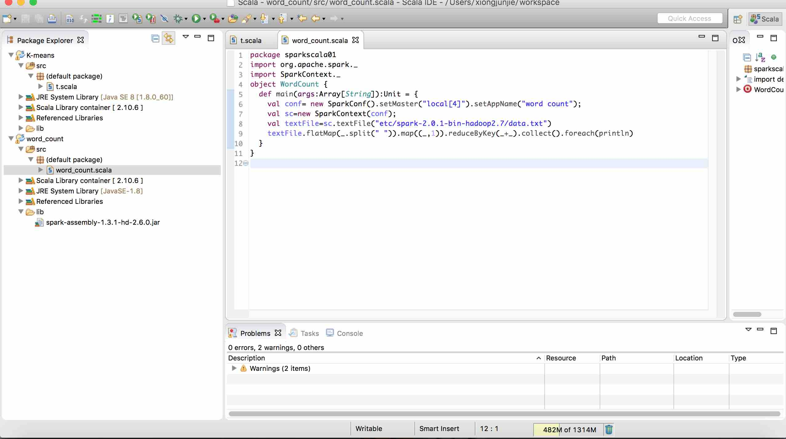

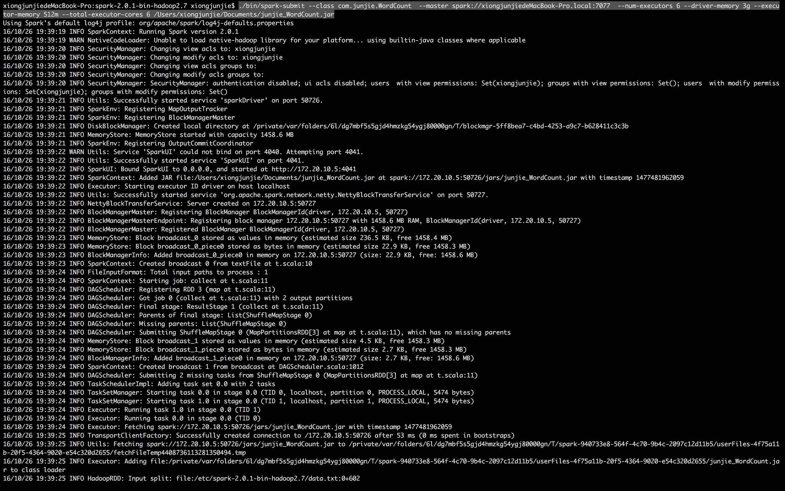
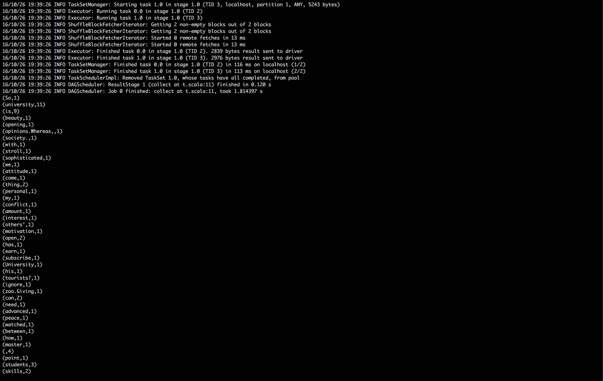
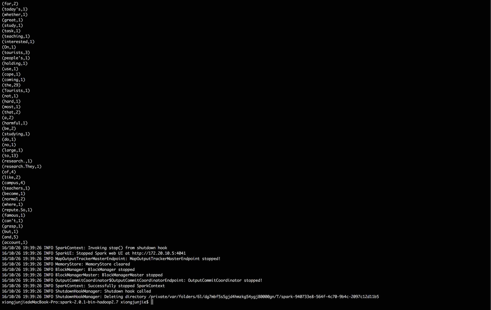


### k-means

#### 注程序参数为：
训练数据集路径
测试数据集路径
聚类个数
迭代次数
算法次数

```
  ./bin/spark-submit --class com.junjie.KMeansClustering \
 --master spark://xiongjunjiedeMacBook-Pro.local:7077  \
 --num-executors 6 \
--driver-memory 3g \
--executor-memory 512m \
--total-executor-cores 6 \
 /Users/xiongjunjie/Documents/junjie_k-means.jar \
 /Users/xiongjunjie/Documents/TrainData.txt \
/Users/xiongjunjie/Documents/TestData.txt \
 8 30 3
```

#### 实验截图
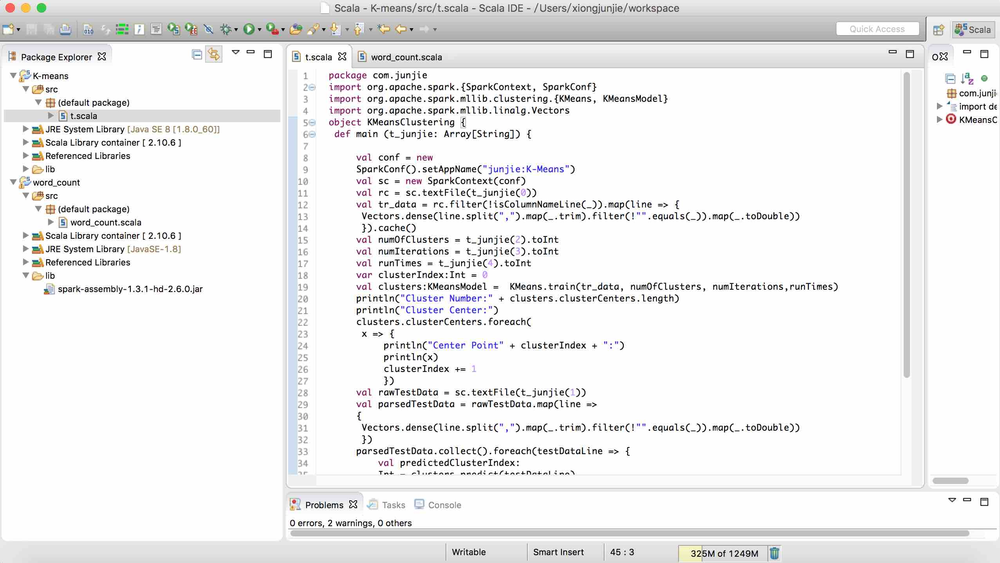

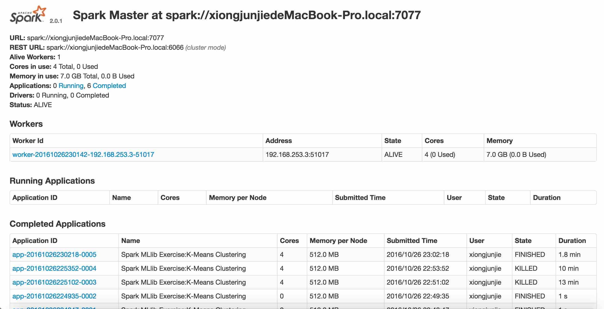

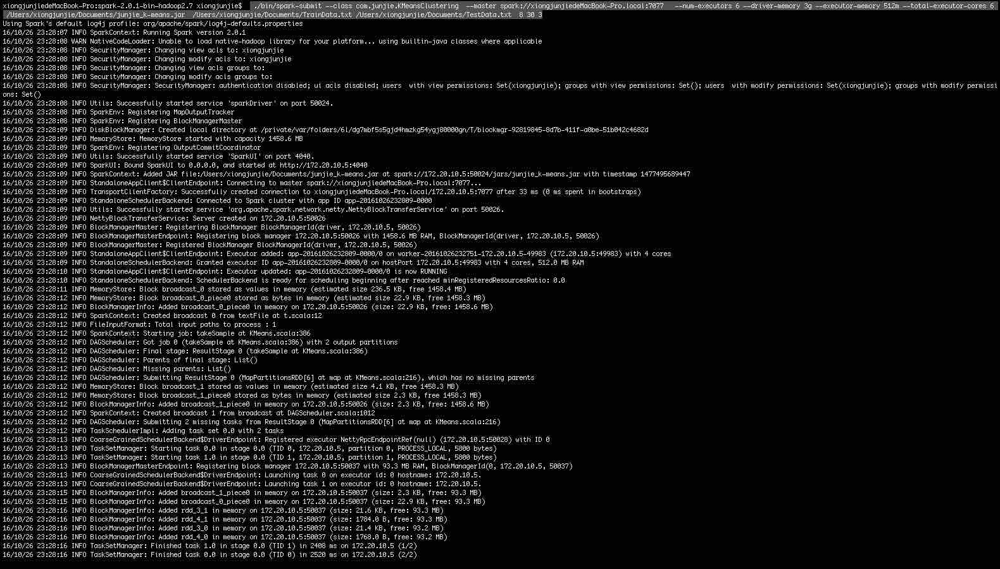
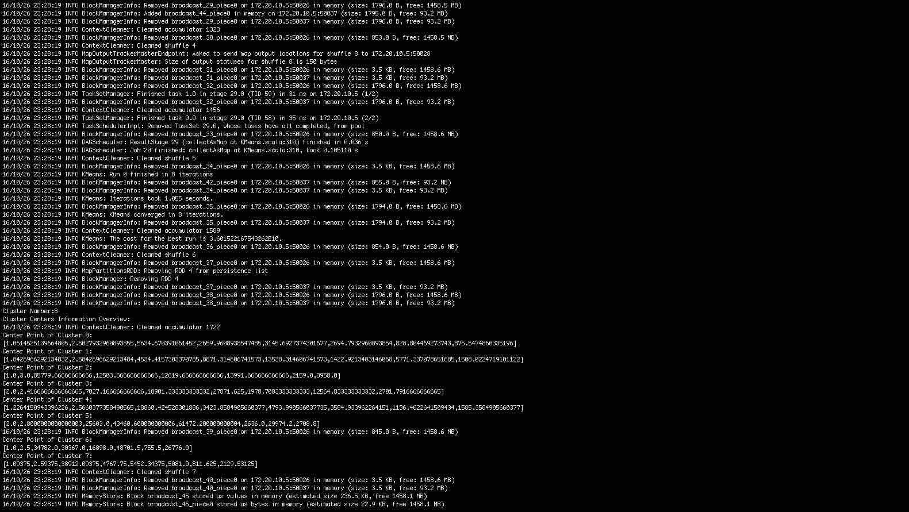
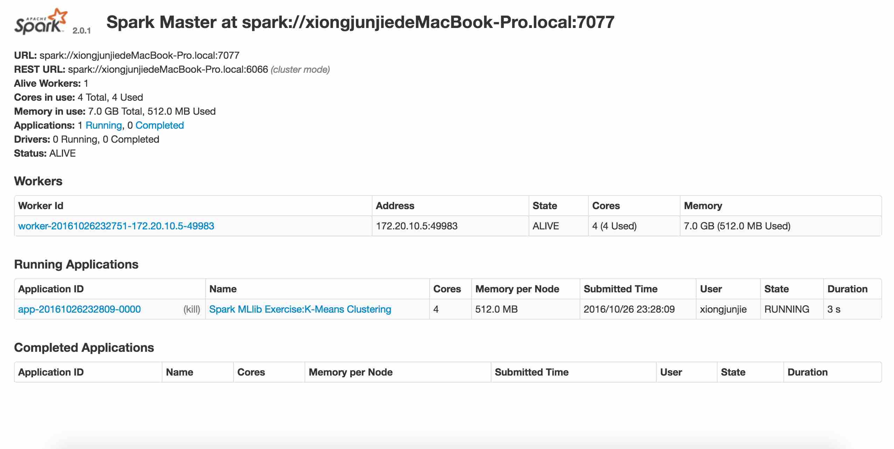


# 安装Spark部分

安装：- [url](http://spark.apache.org/downloads.html)   
文档：- [url](https://spark.apache.org/docs/latest/spark-standalone.html#starting-a-cluster-manually)

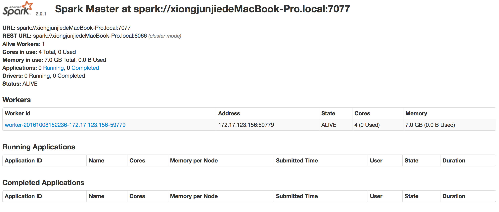

运行：./bin/run-example SparkPi 10 测试命令
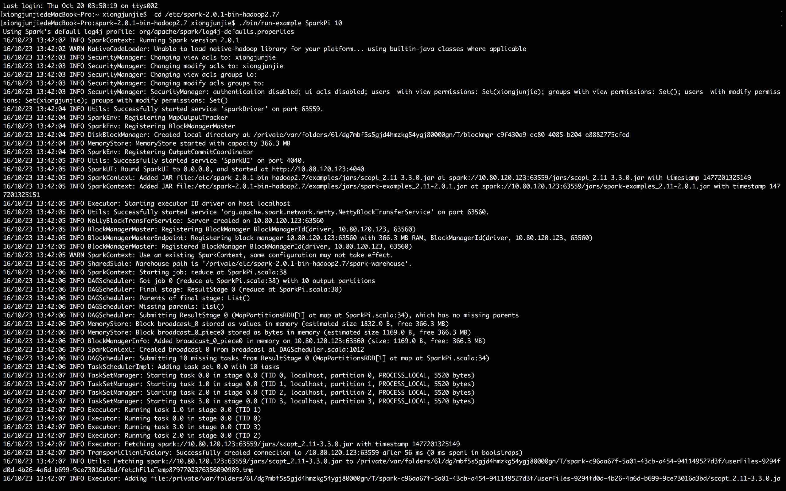

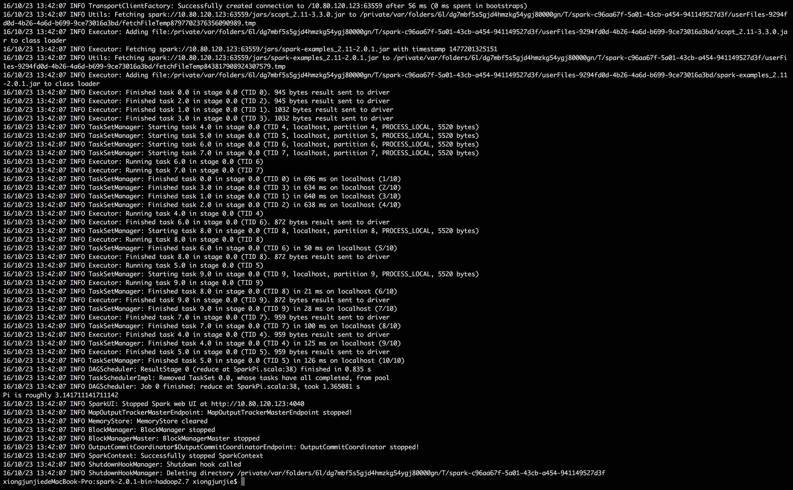

##  启动
./sbin/start-master.sh

##   查看
http://localhost:8080 

##  ［加子嗣］现在的主机是个光杆司令，要给他派兵啊。
“./bin/spark-class org.apache.spark.deploy.worker.Worker spark://xiongjunjiedeMacBook-Pro.local:7077” 安心的拍下回车吧！
刷刷几页信息跳过后，这个窗口就像死了机一样了。别担心，这是因为这个命令端已经作为子嗣为你刚建立的主机开始卖命了。不信的话你刷新一下主机信息网页。
http://localhost:8080
在“Workers”列表下赫然出现了你的第一个子嗣。其状态State为ALIVE。表示它正在运作。这时候你需要记住，当前Terminal的窗口对应就是那个刚加入的Worker Id。

##  ［删除子嗣］“Ctrl ＋ C”就行了。
这时候命令行回复工作，而主机信息网页刷新后会将对应子嗣的state改成DEAD。说明和子嗣的联系切断了。此信息回保留一段时间，然后会被完全删除。

##  ［关闭主机］
./sbin/stop-master.sh
这时http://localhost:8080/ 刷新后就是空网页了。

如果你有没有关闭的子嗣。在其terminal窗口中会显示其试图重连主机的信息。如果你再次打开主机（而且port号没变的话），没关的子嗣会重新连上去。


